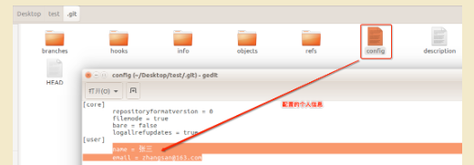

## 1.Git单人本地仓库操作（Linux系统为例）

### **1.1.安装git**

```
  sudo apt-get install git
  密码：chuanzhi
```

### 1.**2.查看git安装结果**

```
  git
```

### 1.**3.创建项目**

在桌面创建`test`文件夹，表示是工作项目

```
  Desktop/test/
```

### 1.**4.创建本地仓库**

1. 进入到`test`，并创建本地仓库`.git`

2. 新创建的本地仓库`.git`是个空仓库

   ```
     cd Desktop/test/
     git init
   ```

​	3.创建本地仓库`.git`后


**注意：**进入该待显示的文件路径，ctrl + h ，则显示隐藏文件

### 1.**5.配置个人信息**

```
  git config user.name '张三'
  git config user.email 'zhangsan@163.com'
```




**注意：**默认不配置的话，会使用全局配置里面的用户名和邮箱全局git配置文件路径：~/.gitconfig

### 1.**6.新建py文件**

​	在项目文件`test`里面创建`login.py`文件，用于版本控制演示


### **1.7.查看文件状态**

​	1.红色表示新建文件或者新修改的文件,都在工作区.

​	2.绿色表示文件在暂存区

​	3.新建的`login.py`文件在工作区，需要添加到暂存区并提交到仓库区

```
git status
```


### 1.**8.将工作区文件添加到暂存区**

```
  # 添加项目中所有文件
  git add .
  或者
  # 添加指定文件
  git add login.py
```


### 1.**9.将暂存区文件提交到仓库区**

​	1.\`commit`会生成一条版本记录

​	2.`-m`后面是版本描述信息

```
git commit -m '版本描述'
```


### 1.**10.添加和提交合并命令**

```
  git commit -am "版本描述"
```

### 1.**11.查看历史版本**

```
  git log
  或者
  git reflog
```


**注意：**git reflog 可以查看所有分支的所有操作记录（包括commit和reset的操作），包括已经被删除的commit记录，git log 则不能察看已经删除了的commit记录

### **1.12.回退版本**

**方案一：**

- `HEAD`表示当前最新版本
- `HEAD^`表示当前最新版本的前一个版本
- `HEAD^^`表示当前最新版本的前两个版本，**以此类推...**
- `HEAD~1`表示当前最新版本的前一个版本
- `HEAD~10`表示当前最新版本的前10个版本，**以此类推...**

例如：

```
git reset --hard HEAD^
```


**方案二：当版本非常多时可选择的方案**

通过每个版本的版本号回退到指定版本

```
  git reset --hard 版本号
```


### 1.**13.撤销修改**

- 只能撤销工作区、暂存区的代码,不能撤销仓库区的代码

- 撤销仓库区的代码就相当于回退版本操作

  

#### 1、撤销工作区代码

- 新加代码`num3 = 30`，不`add`到暂存区，保留在工作区

  ```
  git checkout 文件名
  ```


#### 2、撤销暂存区代码

- 新加代码`num3 = 30`，并`add`到暂存区

```
# 第一步：将暂存区代码撤销到工作区
git reset HEAD  文件名
# 第二步：撤销工作区代码
git checkout 文件名
```

