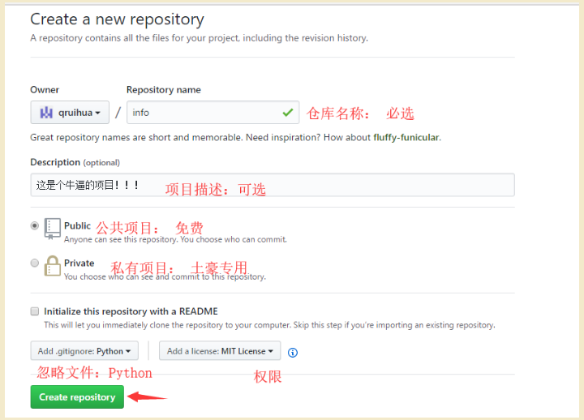
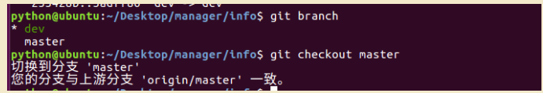

## 2.Git远程仓库Github

### 2.1.创建远程仓库

- 1.登陆注册Github
- 2.创建仓库入口

- 3.编辑仓库信息



- 4.仓库创建完成


- 5.查看仓库地址


### 2.2.配置ssh密钥（仅选择SSH操作时需要配置）

​	**选择SSH操作**：

- 如果某台电脑需要与`Github`上的仓库交互，那么就要把这台电脑的SSH公钥添加到这个`Github`账户上


**配置步骤如下：**

- 1.配置SSH公钥入口


- 2.生成SSH公钥

  ```
   ssh-keygen -t rsa -C "qiruihua@itcast.cn"
  ```


- 3.配置SSH公钥


- 补充：删除旧的秘钥
  - 删除`~/.ssh`目录，这里存储了旧的密钥
    rm -r .ssh


- [x] SSH操作报错


**解决方案为**

```
eval "$(ssh-agent -s)"
ssh-add
```


### 2.3.克隆项目（两人开发为例）

- 准备经理的文件 `Desktop/manager/`
- 准备张三的文件 `Desktop/zhangsan/`

#### 1、经理的工作

- 克隆远程仓库+配置身份信息+创建项目+推送项目到远程仓库

- 1.克隆远程仓库的命令

```
  cd Desktop/manager/
  git clone https://github.com/qruihua/info.git
```

- 2.克隆远程仓库到本地


- 3.克隆成功后查看经理的文件


- 4.配置经理身份信息

```
  cd Desktop/manager/info/
  git config user.name '经理'
  git config user.email 'manager@itcast.com'
```


- 5.创建项目


- 6.推送项目到远程仓库

```
  # 工作区添加到暂存区
  git add .
  # 暂存区提交到仓库区
  git commit -m '立项'
  # 推送到远程仓库
  git push
```


- 在 push 的时候需要设置账号与密码，该密码则是 github 的账号与密码

如果在每次 push 都需要设置账号与密码，那么可以设置记住密码

```
设置记住密码（默认15分钟）：
git config --global credential.helper cache
如果想自己设置时间，可以这样做(1小时后失效)：
git config credential.helper 'cache --timeout=3600'
长期存储密码：
git config --global credential.helper store
```


#### 2、张三的工作

- 获取项目：克隆项目到本地、配置身份信息

- 1.克隆项目到本地

```
  cd Desktop/zhangsan/
  git clone https://github.com/qruihua/info.git
```


- 2.克隆成功后查看张三的文件


- 3.配置张三身份信息

```
  cd Desktop/zhangsan/info/
  git config user.name '张三'
  git config user.email 'zhangsan@itcast.com'
```

**注意：**张三身份信息配置成功后即可跟经理协同开发同一个项目


### 2.4.标  签

- 当某一个大版本完成之后,需要打一个标签
- 作用：
  - 记录大版本
  - 备份大版本代码


#### 模拟经理打标签

- 1.进入到经理的本地仓库info

```
 cd Desktop/manager/info/
```

- 2.经理在本地打标签

```
 git tag -a 标签名 -m '标签描述'
 例：
 git tag -a v1.0 -m 'version 1.0'
```


- 3.经理推送标签到远程仓库

```
 git push origin 标签名
 例：
 git push origin v1.0
```

- 4.github远程查看打标签结果


- 补充：删除本地和远程标签

```
  # 删除本地标签
  git tag -d 标签名
  # 删除远程仓库标签
  git push origin --delete tag 标签名
```


### 2.5. 分  支


- 作用：
  - 区分生产环境代码以及开发环境代码
  - 研究新的功能或者攻关难题
  - 解决线上bug
- 特点：
  - 项目开发中公用分支包括master、dev
  - 分支master是默认分支，用于发布，当需要发布时将dev分支合并到master分支
  - 分支dev是用于开发的分支，开发完阶段性的代码后，需要合并到master分支

#### 模拟经理分支操作

- 对比：操作分支前的代码


- 1.进入到经理的本地仓库info

```
 cd Desktop/manager/info/
```

- 2.查看当前分支

```
  git branch
```

- 没有创建其他分支时，只有`master`分支


- 3.经理创建并切换到dev分支

```
 git checkout -b dev
```

- 4.设置本地分支跟踪远程指定分支（将分支推送到远程）

```
  git push -u origin dev
```

- 5.经理在dev分支编辑代码


- 6.管理dev分支源代码：`add`、`commit`、`push`


- 7.dev分支合并到master分支
  - 提示：只有当dev分支合并到master分支成功，张三才能获取到`num4`



​	1、先切换到master分支

```
  git checkout master
```


​	2 、dev分支合并到master分支

```
git merge dev
```


​	3、经理推送合并分支操作到远程仓库

```
git push
```


- 8.张三同步经理合并后的`num4`

​		只有当张三同步代码成功，分支合并才算成功

```
  cd Desktop/zhangsan/info/
  git pull
```

